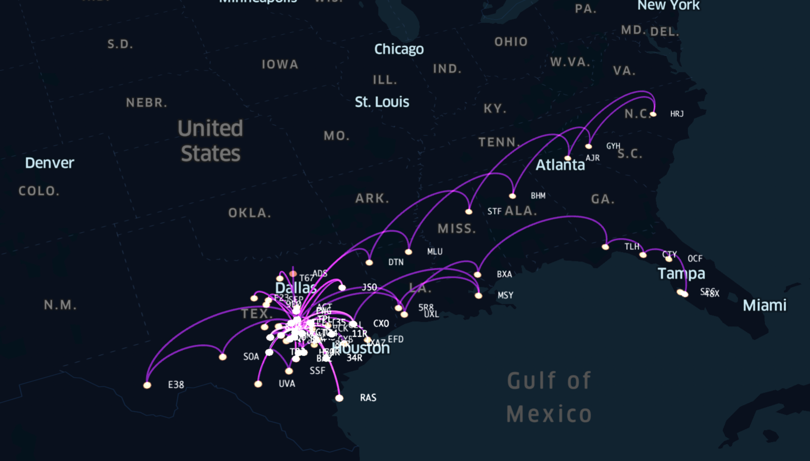

# Flight Log Mapper

This small nodejs application takes a [ForeFlight](https://foreflight.com) or [Garmin Pilot](https://buy.garmin.com/en-US/US/p/115856) logbook CSV export, and along with the FAA database of airports, performs the data processing necessary to translate it into a CSV for use on [kepler.gl](https://kepler.gl) for mapping. 

The code presently only works for US-based airports, as I am using an FAA sourced airport lookup table.

## Requirements

* Node.js v15 or greater
* [FAA Airport Database from FAA Open Data](https://opendata.arcgis.com/datasets/e747ab91a11045e8b3f8a3efd093d3b5_0.csv) - https://adds-faa.opendata.arcgis.com
* One of:
  * ForeFlight Logbook CSV Export - you can get this from your personal portal at https://plan.foreflight.com.
  * Garmin Pilot Logbook CSV Export - you can get this from your FlyGarmin portal under the Setup | Export to Spreadsheet button at https://fly.garmin.com/fly-garmin/logbook/#/setup. 

## Runing the Script

* (optional) Update the USA airport database at `data/airports.csv` directory with the latest version from the FAA.
* Place your exported logbook as `data/logbook.csv` in the data directory.
* Run `npm install` to install dependencies.
* Execute `node main.js`.
* Take the `out.csv` that was generated and import at [kepler.gl](https://kepler.gl). 
* Adjust map styles and such as required.

*"Fun Mode"* - open this project in Visual Studio Code with the [Geo Data Viewer Extension](https://marketplace.visualstudio.com/items?itemName=RandomFractalsInc.geo-data-viewer), select your `out.csv` file, and view the map from directly inside VSCode.

## Limitations (Today)

* Only available for US Airports
* The script right now depends on a particular format for the "Route" field which I look for spaces or dashes between waypoints. It does a best-case lookup to see if there's an airport match for an identifier. If a VOR and ID match (i.e. CTY VOR, CTY Airport), the script can't tell if it's the VOR or you landed there. I may update this later to require some delimiter like MyFlightBook.com does.

## Disclaimers

ForeFlight is a trademark of the Boeing company. There is no connection between this app and the ForeFlight application or company. I am just a big fan and user that depends on the great software they make to ensure the safety of myself and my passengers when we fly. Thank you to the whole ForeFlight team for making such a great application! Please visit them at **[foreflight.com](https://foreflight.com)**, buy their software, and get out and fly!

Garmin Pilot is a trademark of Garmin and again, there is no connection between the app and that awesome team. A fellow pilot encouraged me to adapt the code to work for their logbooks as well, and I was happy to. EFB's make flying safer and easier. Go out and get the one that works best for you!

## License

Please see the [`LICENSE`](LICENSE) file in this repository for details.

## Contributing

Contributions are welcome and encouraged. This was a fun project to create. I am sure there are others out there who can do it better. Please submit pull requests and improve it for everyone!
